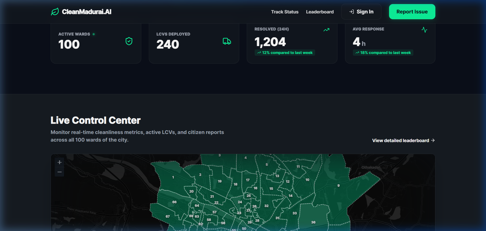
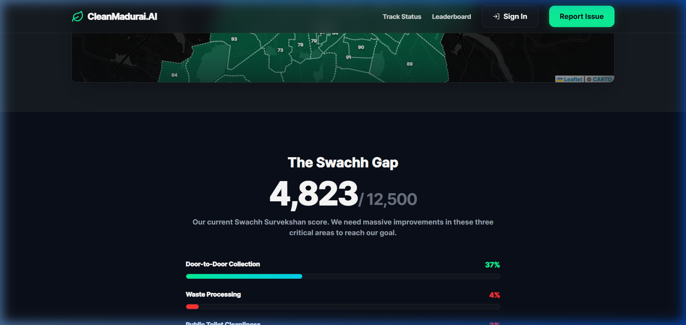
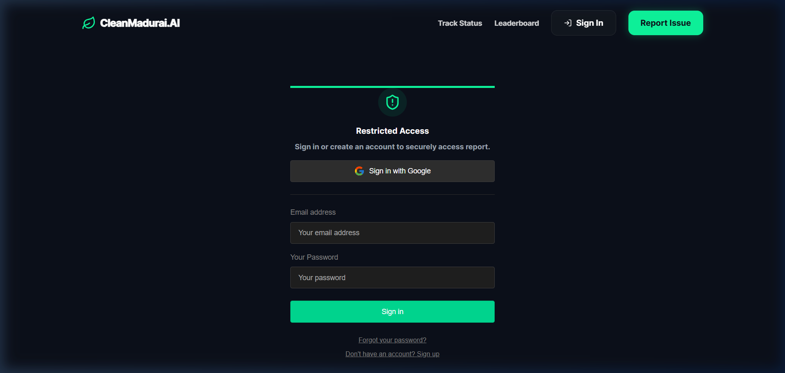
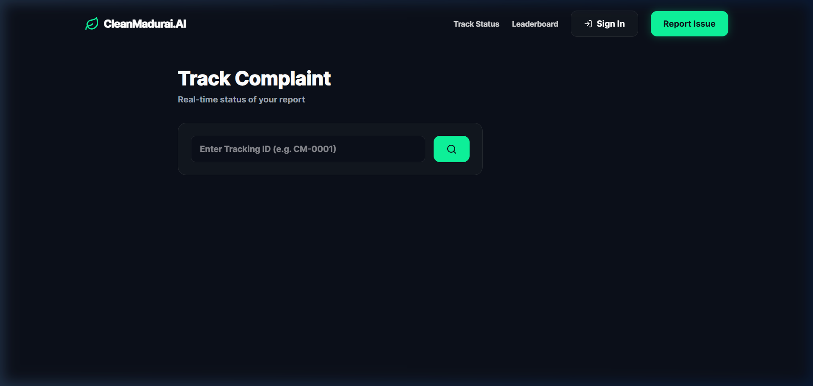
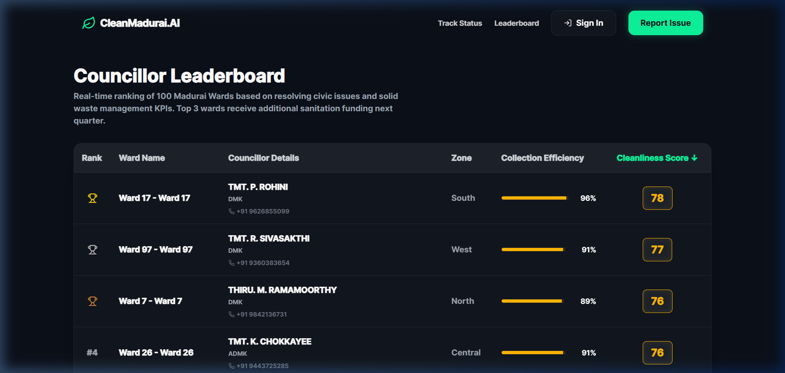
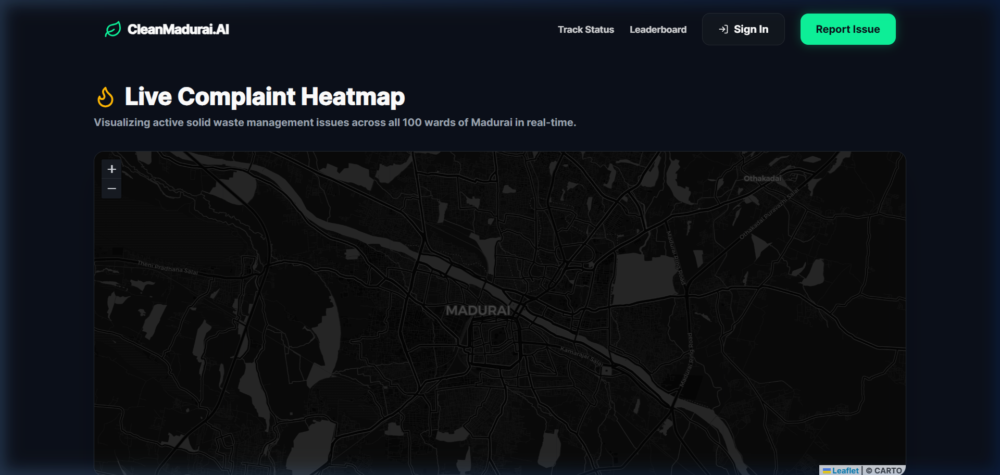
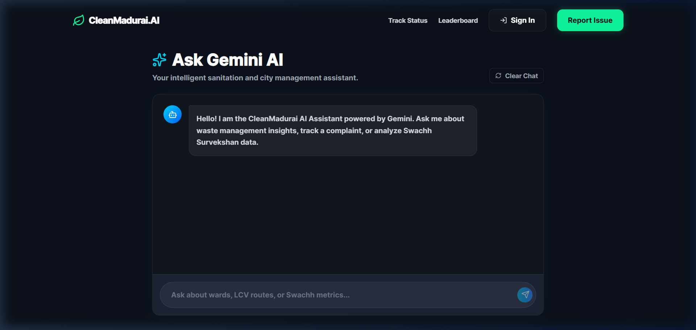
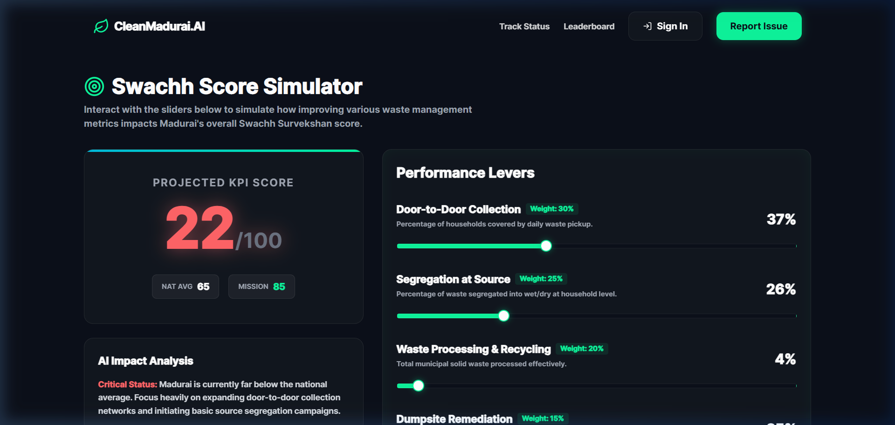

<p align="center">
  
</p>

<h1 align="center">🌿 CleanMadurai.AI</h1>

<p align="center">
  <strong>AI-Powered Civic Tech Platform for Urban Cleanliness</strong><br/>
  <em>Transforming Madurai. Together.</em>
</p>

<p align="center">
  
  
  
  
  
  
  
</p>

---

## 📋 Table of Contents

- [Overview](#-overview)
- [Screenshots](#-screenshots)
- [Features](#-features)
- [Tech Stack](#-tech-stack)
- [Architecture](#-architecture)
- [Getting Started](#-getting-started)
- [Project Structure](#-project-structure)
- [Documentation](#-documentation)
- [Environment Variables](#-environment-variables)
- [Deployment](#-deployment)
- [Roadmap](#-roadmap)
- [Contributing](#-contributing)
- [License](#-license)

---

## 🧠 Overview

**CleanMadurai.AI** is a premium civic-tech web platform designed to transform Madurai's urban cleanliness. The platform enables citizens to report waste and sanitation issues, uses AI to automatically triage complaint priority, and empowers admin/councillors to dispatch LCV (waste collection) drivers for resolution — all in real-time.

### 🎯 Mission
> Achieve **Swachh Survekshan Top 10** ranking for Madurai by 2026.

### 👥 Two Roles

| Role | Who | Access |
|------|-----|--------|
| **Admin/Councillor** | City official who manages everything | First signup auto-assigned as admin |
| **Citizen** | Any resident of Madurai | All subsequent signups |

> **Note:** LCV drivers don't have app access — the admin dispatches them manually from the dashboard.

---

## 📸 Screenshots

### Landing Page — Cinematic Parallax Hero
The landing page features a parallax hero section with animated gradient backgrounds, floating particles, and a bold call-to-action.


### Live Control Center — Real-Time KPIs & Ward Map
Live metrics showing Active Wards, LCVs Deployed, Garbage Fixed, and Volunteers Online alongside an interactive Leaflet ward map.



### The Swachh Gap — Performance Dashboard
Current Swachh Survekshan score with detailed progress bars for Door-to-Door Collection, Waste Processing, and Public Toilet Cleanliness.



### Authentication Gateway
Secure sign-in/sign-up page with Email + Google OAuth powered by Supabase Auth.



### Complaint Tracker — Real-Time Status
Citizens can track their complaint status in real-time using a unique tracking ID, with an animated status timeline.



### Councillor Leaderboard — Ward Rankings
Real-time ranking of all 100 Madurai wards based on cleanliness scores, collection efficiency, and resolved complaints.



### Complaint Heatmap — Density Visualization
Interactive GIS heatmap showing complaint density across Madurai wards with filterable categories.



### AI Chatbot — Gemini-Powered Assistant
Conversational AI assistant powered by Google Gemini 1.5 Pro for civic queries, complaint guidance, and FAQ resolution.



### Swachh Score Simulator
Interactive calculator that simulates how different improvements affect Madurai's Swachh Survekshan ranking.



---

## ✨ Features

### Citizen Features
| Feature | Description |
|---------|-------------|
| 📍 **Report Issues** | Multi-step wizard with map location, photo upload, and issue categorization |
| 🔍 **Track Complaints** | Real-time status timeline with animated progress indicators |
| 🏆 **Ward Leaderboard** | Live ward rankings with councillor details, party badges, and scores |
| 🗺️ **Complaint Heatmap** | Interactive GIS density map with category + priority filters |
| 🤖 **AI Chatbot** | Gemini-powered civic assistant for queries and guidance |
| 📊 **Swachh Simulator** | Interactive score calculator with sliders and scenario modeling |

### Admin Features
| Feature | Description |
|---------|-------------|
| 📈 **Real-Time Dashboard** | Live KPIs, complaint tables, trend charts with auto-refresh |
| 🚛 **LCV Dispatch** | One-click driver assignment with driver roster management |
| 👥 **User Management** | View citizens, track activity, manage accounts |
| 🗺️ **Ward Management** | Ward data, councillor mapping, boundary visualization |
| 📊 **Analytics** | Time-series charts, CSV export, ward-level comparisons |
| ⚙️ **Settings** | AI prompt customization, app branding, announcements |

### Technical Features
| Feature | Description |
|---------|-------------|
| 🤖 **AI Triage** | Gemini 1.5 Pro auto-classifies complaint priority (critical/high/medium/low) |
| ⚡ **Real-Time** | Supabase Realtime subscriptions for live complaint status updates |
| 🔐 **RLS Security** | Row-Level Security policies enforce role-based data access |
| 🎭 **GSAP Animations** | Cinematic parallax, scroll-driven effects, micro-interactions |
| 📱 **Responsive** | Mobile-first design with adaptive layouts and drawer navigation |
| 🗺️ **GIS Maps** | Leaflet + CARTO dark tiles for ward polygon visualization |

---

## 🛠️ Tech Stack

| Layer | Technology | Purpose |
|-------|-----------|---------|
| **Framework** | React 19 + Vite 7 | Fast SPA with HMR |
| **Styling** | Tailwind CSS v4 + Vanilla CSS | Utilities + custom design system |
| **Animation** | GSAP 3 + ScrollTrigger | Cinematic parallax & scroll effects |
| **Maps** | Leaflet + CARTO Dark Tiles | Ward polygon visualization |
| **Backend** | Supabase (PostgreSQL + Auth + Storage) | Full BaaS with real-time |
| **Edge Functions** | Supabase Edge Functions (Deno) | Server-side AI triage & cron |
| **AI** | Google Gemini 1.5 Pro | Complaint triage + chatbot |
| **Icons** | Lucide React | Tree-shakeable icon library |
| **Toasts** | react-hot-toast | Notification system |
| **Routing** | react-router-dom v7 | Client-side SPA routing |

---

## 🏗️ Architecture

For a detailed architecture overview, see [**docs/architecture.md**](docs/architecture.md).

```
┌──────────────────────────────────────────────────────────────┐
│                    🖥️ Frontend (React + Vite)                │
│  Landing │ Report │ Track │ Leaderboard │ Heatmap │ Chatbot  │
│  Simulator │ Admin Dashboard │ Admin Complaints │ ...        │
├──────────────────────────────────────────────────────────────┤
│                    📡 API Layer                               │
│           Supabase Client SDK + Realtime Channels            │
├──────────────────────────────────────────────────────────────┤
│                    ☁️ Supabase Backend                        │
│  Auth │ PostgreSQL │ Storage │ Edge Functions │ RLS │ RT     │
├──────────────────────────────────────────────────────────────┤
│                    🔗 External Services                       │
│           Gemini 1.5 Pro │ Leaflet + CARTO Tiles             │
└──────────────────────────────────────────────────────────────┘
```

---

## 🚀 Getting Started

### Prerequisites

- **Node.js** 18+ and **npm** 9+
- **Git**
- A **Supabase** project (free tier works)
- A **Google Gemini API** key

### Installation

```bash
# 1. Clone the repository
git clone https://github.com/vedhan7/CLEAN_AI.git
cd CLEAN_AI

# 2. Install dependencies
npm install

# 3. Create environment file
cp .env.example .env
# Edit .env with your Supabase URL, Anon Key, and Gemini API key

# 4. Start the development server
npm run dev
```

### Environment Setup

Create a `.env` file in the project root:

```env
# Supabase Configuration
VITE_SUPABASE_URL=https://your-project.supabase.co
VITE_SUPABASE_ANON_KEY=eyJ...your-anon-key

# Gemini AI (client-side for chatbot)
VITE_GEMINI_API_KEY=your-gemini-api-key
```

### Available Scripts

| Command | Description |
|---------|-------------|
| `npm run dev` | Start Vite dev server with HMR |
| `npm run build` | Build production bundle to `dist/` |
| `npm run preview` | Preview production build locally |

---

## 📁 Project Structure

For a detailed file-by-file breakdown, see [**docs/files.md**](docs/files.md).

```
cleanmadurai-ai/
├── 📄 index.html              # HTML entry point
├── 📄 package.json             # Dependencies & scripts
├── 📄 vite.config.js           # Vite + Tailwind + React config
├── 📄 .env                     # Environment variables (gitignored)
├── 📄 .gitignore               # Git ignore patterns
├── 📄 README.md                # This file
│
├── 📂 src/                     # Application source code
│   ├── 📄 main.jsx             # React entry: BrowserRouter + Toaster
│   ├── 📄 App.jsx              # Route definitions + layout
│   ├── 📄 index.css            # Tailwind imports + CSS cascade
│   │
│   ├── 📂 pages/               # Citizen-facing pages (8 files)
│   ├── 📂 admin/               # Admin panel modules (8 files)
│   ├── 📂 components/          # Shared components (7 files)
│   ├── 📂 hooks/               # React custom hooks (2 files)
│   ├── 📂 lib/                 # Service clients (1 file)
│   ├── 📂 styles/              # CSS design system (5 files)
│   └── 📂 data/                # Static data (1 file)
│
├── 📂 supabase/                # Backend configuration
│   ├── 📂 functions/           # Edge Functions (2 functions)
│   └── 📂 migrations/          # SQL schema + seed data (4 files)
│
├── 📂 scripts/                 # Build/utility scripts
├── 📂 public/                  # Static assets (GeoJSON data)
├── 📂 docs/                    # Project documentation
└── 📂 dist/                    # Production build output
```

---

## 📚 Documentation

| Document | Description |
|----------|-------------|
| [**README.md**](README.md) | Project overview (this file) |
| [**docs/architecture.md**](docs/architecture.md) | System architecture, data flow, and design patterns |
| [**docs/files.md**](docs/files.md) | Detailed file-by-file breakdown with descriptions |
| [**docs/database.md**](docs/database.md) | Database schema, RLS policies, and SQL migrations |
| [**docs/api-reference.md**](docs/api-reference.md) | Edge Functions, hooks, and service client APIs |
| [**docs/design-system.md**](docs/design-system.md) | CSS variables, typography, components, and animations |
| [**docs/deployment.md**](docs/deployment.md) | Deployment guide for Vercel/Netlify + Supabase |

---

## 🔑 Environment Variables

| Variable | Description | Required |
|----------|-------------|----------|
| `VITE_SUPABASE_URL` | Supabase project URL | ✅ |
| `VITE_SUPABASE_ANON_KEY` | Supabase anonymous API key | ✅ |
| `VITE_GEMINI_API_KEY` | Google Gemini API key | ✅ |

**Supabase Edge Function Secrets** (set via `supabase secrets set`):

| Variable | Description |
|----------|-------------|
| `SUPABASE_SERVICE_ROLE_KEY` | Supabase service role key (server-side only) |
| `GEMINI_API_KEY` | Gemini API key for server-side AI triage |

---

## 🚢 Deployment

For a detailed deployment guide, see [**docs/deployment.md**](docs/deployment.md).

### Quick Deploy to Vercel

```bash
# Install Vercel CLI
npm i -g vercel

# Deploy
vercel --prod
```

### Build for Production

```bash
npm run build
# Output in dist/ — deploy to any static host
```

---

## 🗺️ Roadmap

### ✅ Phase 1: Frontend (Citizen-Facing) — Completed
- [x] Design system (CSS variables, components, animations)
- [x] Landing page with parallax hero, KPIs, map, stats
- [x] Responsive navbar with mobile drawer
- [x] GSAP scroll animations
- [x] All citizen pages (Report, Track, Leaderboard, Chatbot, Heatmap, Simulator)

### 🔄 Phase 2: Backend + Admin Panel — In Progress
- [ ] Supabase project setup (tables, RLS, storage)
- [ ] Auth flow (email + Google OAuth, auto-role assignment)
- [ ] Complaint CRUD with photo upload
- [ ] Edge Functions (AI triage, daily analytics cron)
- [ ] Realtime subscriptions for live updates
- [ ] Admin panel (dashboard, complaints, dispatch, users, wards, analytics)
- [ ] Ward data seeding (100 wards with boundaries)
- [ ] Chatbot connected to Gemini API

---

## 🤝 Contributing

Contributions are welcome! Please follow these steps:

1. **Fork** the repository
2. **Create** a feature branch (`git checkout -b feature/amazing-feature`)
3. **Commit** your changes (`git commit -m 'Add amazing feature'`)
4. **Push** to the branch (`git push origin feature/amazing-feature`)
5. **Open** a Pull Request

### Code Style
- Use **functional components** with hooks
- Follow the existing **CSS variable design system**
- Use **Lucide React** for icons
- Write **descriptive commit messages**

---

## 📄 License

This project is licensed under the **MIT License** — see the [LICENSE](LICENSE) file for details.

---

<p align="center">
  <strong>Built with 💚 for Madurai</strong><br/>
  <em>A project by the CleanMadurai.AI team</em>
</p>
