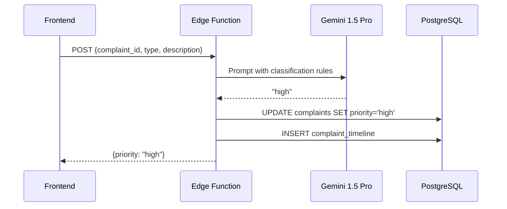

# 📡 API Reference — CleanMadurai.AI

> Edge Functions, custom hooks, and service client APIs.

---

## Table of Contents

- [Edge Functions](#edge-functions)
- [Custom React Hooks](#custom-react-hooks)
- [Supabase Client](#supabase-client)
- [Component APIs](#component-apis)

---

## Edge Functions

### `ai-triage` — AI Priority Classification

**Endpoint:** `POST /functions/v1/ai-triage`

Classifies a complaint's priority using Google Gemini 1.5 Pro API.

#### Request

```json
{
  "complaint_id": "uuid-string",
  "type": "overflowing_bin",
  "description": "Large bin overflowing near bus stand, blocking pedestrian path"
}
```

#### Response

```json
{
  "priority": "high"
}
```

#### Priority Values

| Priority | Criteria |
|----------|----------|
| `critical` | Immediate health/safety risk (dead animal, sewage overflow) |
| `high` | Heavy impact on public spaces (overflowing bin in market) |
| `medium` | Standard issues (missed collection, dirty toilet) |
| `low` | Minor, non-urgent (small littering) |

#### Side Effects
1. Updates `complaints.priority` with AI result
2. Updates `complaints.updated_at` timestamp
3. Inserts timeline entry: `"Complaint filed. AI Priority: HIGH"`

#### Flow Diagram



---

### `daily-analytics` — Cron Job

**Schedule:** `30 18 * * *` (18:30 UTC = midnight IST)

**Trigger:** Automated cron schedule (no HTTP endpoint)

#### What It Does
1. Fetches all complaints created today
2. Aggregates by type, ward, and priority
3. Calculates resolution time averages
4. Upserts into `analytics_daily` table

#### Output Schema

```json
{
  "report_date": "2026-02-28",
  "total_complaints": 42,
  "resolved_complaints": 35,
  "avg_resolution_hours": 4.2,
  "by_type": {
    "overflowing_bin": 15,
    "bulk_waste": 8,
    "missed_collection": 12,
    "dirty_toilet": 5,
    "dead_animal": 1,
    "other": 1
  },
  "by_ward": { "17": 5, "41": 3, "97": 7 },
  "by_priority": { "critical": 2, "high": 10, "medium": 25, "low": 5 }
}
```

---

## Custom React Hooks

### `useAuth()` — Authentication State

**File:** `src/hooks/useAuth.js`

Manages user session, profile fetching, and authentication operations.

#### Returns

```typescript
{
  user: User | null;        // Supabase auth user object
  profile: Profile | null;  // User's profile from profiles table
  loading: boolean;         // True while session/profile is loading
  signIn: (email, password) => Promise<AuthResponse>;
  signUp: (email, password, fullName) => Promise<AuthResponse>;
  signOut: () => Promise<void>;
  isAdmin: boolean;         // true if profile.role === 'admin_councillor'
}
```

#### Usage

```jsx
import { useAuth } from '../hooks/useAuth';

function MyComponent() {
  const { user, profile, loading, signIn, signOut, isAdmin } = useAuth();

  if (loading) return <Spinner />;
  if (!user) return <LoginForm onSubmit={signIn} />;

  return (
    <div>
      <p>Welcome, {profile?.display_name}</p>
      {isAdmin && <AdminPanel />}
      <button onClick={signOut}>Log out</button>
    </div>
  );
}
```

#### Behavior
- On mount: fetches existing session via `supabase.auth.getSession()`
- Subscribes to `onAuthStateChange` for real-time session updates
- Fetches profile from `profiles` table when user is authenticated
- Gracefully handles missing `profiles` table (returns `null`)
- Cleans up subscription on unmount

---

### `useComplaints()` — Complaint Data + Realtime

**File:** `src/hooks/useComplaints.js`

Fetches complaint data and subscribes to Supabase Realtime for live updates.

#### Returns

```typescript
{
  complaints: Complaint[];    // Array of all complaints, newest first
  loading: boolean;           // True during initial fetch
  dispatchComplaint: (id: string, lcvDriver: string) => Promise<boolean>;
}
```

#### Usage

```jsx
import { useComplaints } from '../hooks/useComplaints';

function ComplaintsList() {
  const { complaints, loading, dispatchComplaint } = useComplaints();

  if (loading) return <Skeleton />;

  return complaints.map(c => (
    <ComplaintCard
      key={c.id}
      complaint={c}
      onDispatch={(driverName) => dispatchComplaint(c.id, driverName)}
    />
  ));
}
```

#### Real-Time Events Handled

| Event | Action |
|-------|--------|
| `INSERT` | Prepends new complaint to array |
| `UPDATE` | Replaces updated complaint in-place |
| `DELETE` | Removes complaint from array |

#### `dispatchComplaint(id, lcvDriver)`

1. Updates complaint status to `'dispatched'` with `assigned_lcv`
2. Creates timeline entry: `"LCV Driver {name} dispatched."`
3. Returns `true` on success, `false` on error

---

## Supabase Client

### `supabase.js` — Client Initialization

**File:** `src/lib/supabase.js`

```javascript
import { createClient } from '@supabase/supabase-js';

const supabaseUrl = import.meta.env.VITE_SUPABASE_URL;
const supabaseAnonKey = import.meta.env.VITE_SUPABASE_ANON_KEY;

export const supabase = createClient(supabaseUrl, supabaseAnonKey);
```

### Common Query Patterns

```javascript
// Fetch all complaints (ordered by newest)
const { data, error } = await supabase
  .from('complaints')
  .select('*')
  .order('created_at', { ascending: false });

// Insert a new complaint
const { data, error } = await supabase
  .from('complaints')
  .insert({ user_id, ward_id, type, description, latitude, longitude });

// Update complaint status
const { error } = await supabase
  .from('complaints')
  .update({ status: 'dispatched', assigned_lcv: driverName })
  .eq('id', complaintId);

// Subscribe to real-time changes
const channel = supabase
  .channel('public:complaints')
  .on('postgres_changes', { event: '*', schema: 'public', table: 'complaints' },
    (payload) => handleChange(payload)
  )
  .subscribe();

// Upload photo to storage
const { data, error } = await supabase.storage
  .from('complaints')
  .upload(`${complaintId}/${filename}`, file);
```

---

## Component APIs

### `Button` — Variant Button

```jsx
<Button
  variant="primary"   // "primary" | "secondary" | "ghost" | "danger"
  size="md"           // "sm" | "md" | "lg"
  loading={false}     // Shows spinner when true
  onClick={() => {}}
  className=""        // Additional Tailwind classes
>
  Click Me
</Button>
```

### `Badge` — Status/Priority/Party Badge

```jsx
<Badge type="status" value="pending" />      // Gray
<Badge type="status" value="dispatched" />   // Blue
<Badge type="status" value="resolved" />     // Green
<Badge type="priority" value="critical" />   // Red
<Badge type="priority" value="high" />       // Orange
<Badge type="party" value="DMK" />           // Party colors
```

### `GlassCard` — Glassmorphism Container

```jsx
<GlassCard className="p-6">
  <h2>Card Content</h2>
  <p>With frosted glass effect</p>
</GlassCard>
```

### `WardMap` — Leaflet Ward Polygon Map

```jsx
<WardMap
  onWardClick={(wardId) => {}}        // Ward click handler
  highlightWard={41}                   // Highlighted ward ID
  showComplaints={true}                // Overlay complaint markers
/>
```

---

<p align="center">
  <em>See <a href="database.md">database.md</a> for schema details | <a href="architecture.md">architecture.md</a> for system design</em>
</p>
