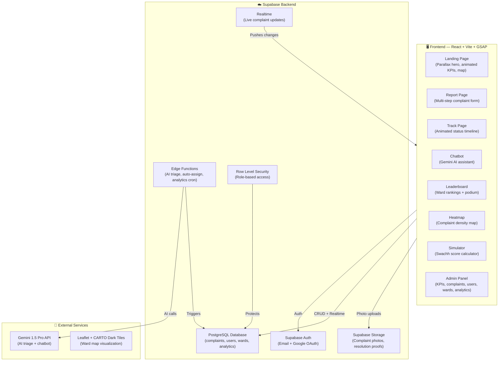
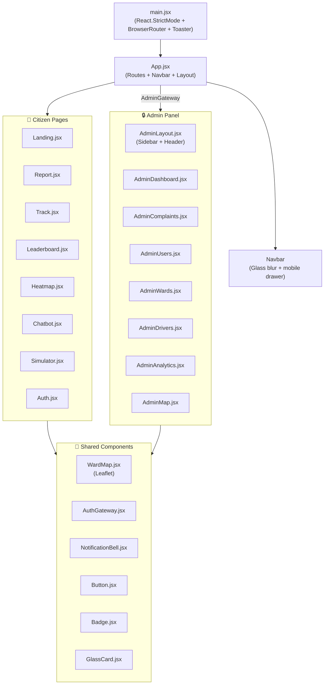
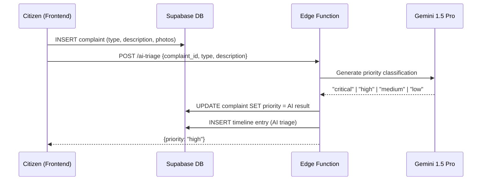
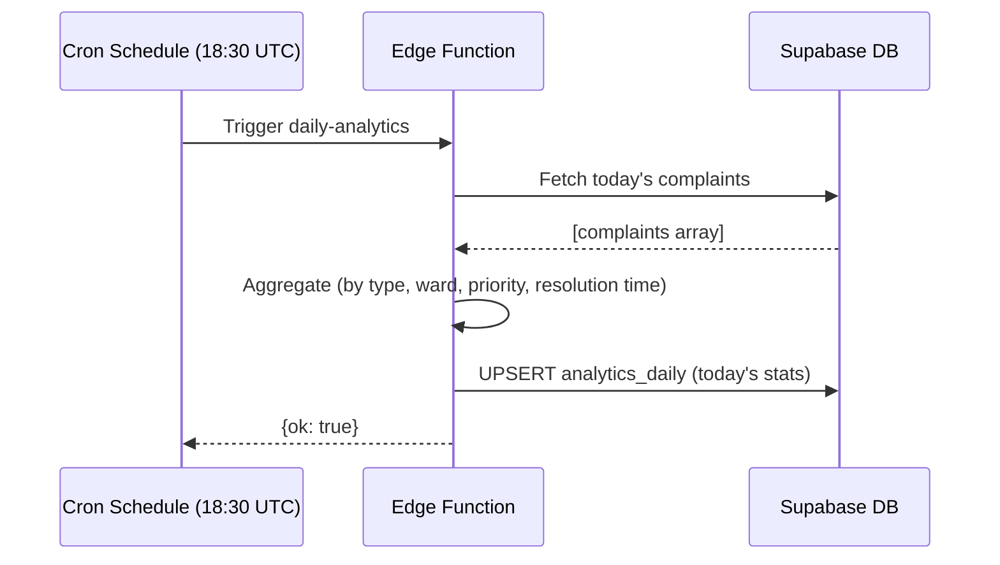
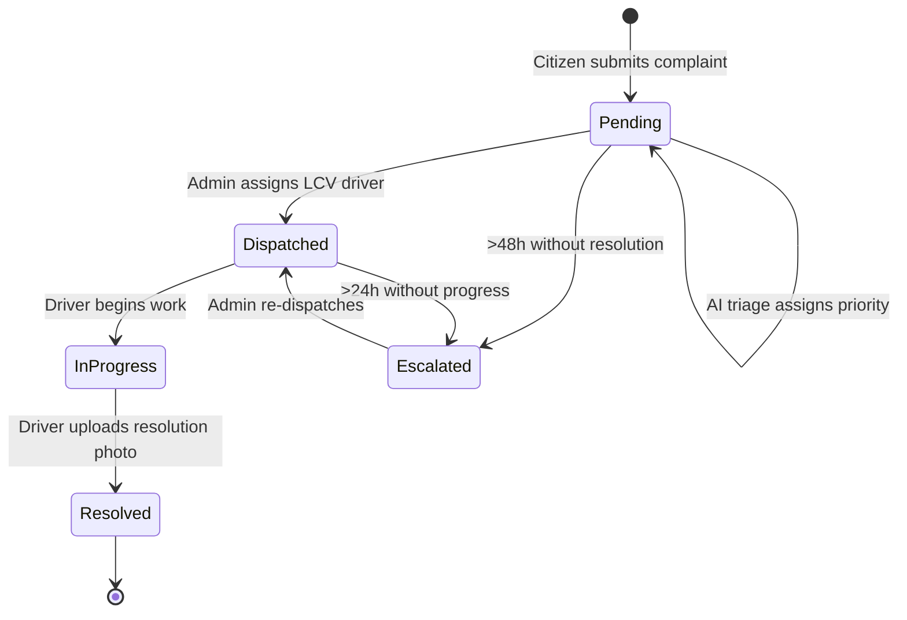
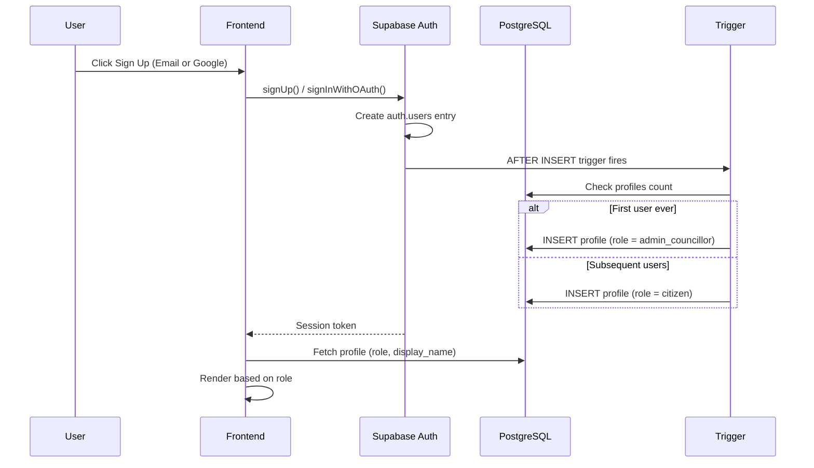
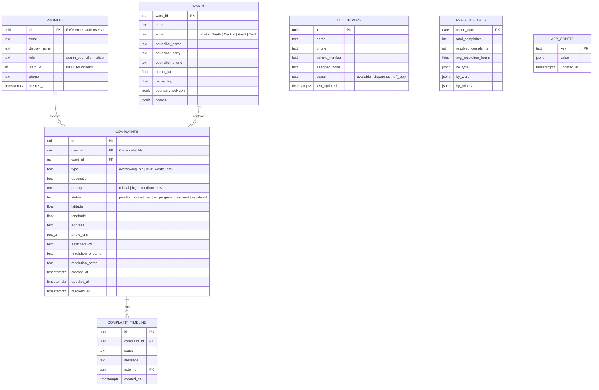

# 🏗️ Architecture — CleanMadurai.AI

> **Version**: 3.0 | **Last Updated**: 2026-02-28  
> A comprehensive architectural overview of the CleanMadurai.AI civic-tech platform.

---

## Table of Contents

- [System Overview](#system-overview)
- [High-Level Architecture](#high-level-architecture)
- [Frontend Architecture](#frontend-architecture)
- [Backend Architecture](#backend-architecture)
- [Data Flow Diagrams](#data-flow-diagrams)
- [Database Schema](#database-schema)
- [Security Model](#security-model)
- [AI Pipeline](#ai-pipeline)
- [Design System](#design-system)

---

## System Overview

CleanMadurai.AI follows a **modern JAMstack architecture** with a React SPA frontend and Supabase BaaS (Backend-as-a-Service) backend. The system is designed for real-time data flow, AI-powered complaint triage, and role-based access control.

```
┌─────────────────────────────────────────────────────────────────┐
│                         CLIENTS                                  │
│  ┌──────────┐  ┌──────────┐  ┌──────────┐  ┌──────────┐        │
│  │ Citizen  │  │ Citizen  │  │  Admin   │  │ Citizen  │        │
│  │ (Mobile) │  │(Desktop) │  │(Desktop) │  │ (Tablet) │        │
│  └────┬─────┘  └────┬─────┘  └────┬─────┘  └────┬─────┘        │
│       └──────────────┴──────────────┴──────────────┘             │
│                           │                                      │
│                    HTTPS / WSS                                   │
│                           │                                      │
├───────────────────────────┼──────────────────────────────────────┤
│                    FRONTEND SPA                                  │
│  React 19 + Vite 7 + Tailwind CSS v4 + GSAP 3                  │
│  ┌──────────────────────────────────────────┐                   │
│  │  Pages: Landing│Report│Track│Leaderboard │                   │
│  │         Heatmap│Chatbot│Simulator         │                   │
│  │  Admin: Dashboard│Complaints│Users│Wards  │                   │
│  │         Drivers│Analytics│Settings        │                   │
│  └────────────────────┬─────────────────────┘                   │
│                       │                                          │
├───────────────────────┼──────────────────────────────────────────┤
│                 SUPABASE BACKEND                                 │
│  ┌────────┐ ┌──────────┐ ┌─────────┐ ┌──────────┐              │
│  │  Auth  │ │PostgreSQL│ │ Storage │ │  Edge    │              │
│  │(OAuth) │ │   (RLS)  │ │ (Files) │ │Functions │              │
│  └────────┘ └──────────┘ └─────────┘ └──────────┘              │
│                                           │                      │
├───────────────────────────────────────────┼──────────────────────┤
│                 EXTERNAL SERVICES          │                      │
│  ┌──────────────────┐  ┌─────────────────┐│                      │
│  │ Google Gemini    │  │ Leaflet + CARTO ││                      │
│  │ 1.5 Pro API     │  │ Map Tiles       ││                      │
│  └──────────────────┘  └─────────────────┘│                      │
└───────────────────────────────────────────┴──────────────────────┘
```

---

## High-Level Architecture



---

## Frontend Architecture

### Component Hierarchy



### Routing Architecture

| Route | Component | Guard | Description |
|-------|-----------|-------|-------------|
| `/` | `Landing` | None | Public landing page |
| `/report` | `Report` | `AuthGateway` | Requires login |
| `/track` | `Track` | None | Public complaint tracker |
| `/leaderboard` | `Leaderboard` | None | Public ward rankings |
| `/heatmap` | `Heatmap` | None | Public density map |
| `/chatbot` | `Chatbot` | None | Public AI assistant |
| `/simulator` | `Simulator` | None | Public score calculator |
| `/admin/*` | `AdminLayout` | `AdminGateway` | Admin-only panel |

### State Management

The app uses **React hooks + Supabase client** for state management. There is no global state store (Redux/Zustand) — state is co-located within components and shared through custom hooks:

```
┌──────────────────────────────────────────┐
│              Custom Hooks                 │
│  ┌─────────────┐  ┌──────────────────┐   │
│  │  useAuth()  │  │ useComplaints()  │   │
│  │  - user     │  │ - complaints     │   │
│  │  - profile  │  │ - loading        │   │
│  │  - isAdmin  │  │ - dispatch()     │   │
│  │  - signIn() │  │ - realtime sub   │   │
│  │  - signUp() │  │                  │   │
│  │  - signOut()│  │                  │   │
│  └──────┬──────┘  └────────┬─────────┘   │
│         │                  │              │
│         ▼                  ▼              │
│  ┌──────────────────────────────────┐    │
│  │     Supabase Client (lib/)       │    │
│  │  supabase.js → createClient()    │    │
│  └──────────────────────────────────┘    │
└──────────────────────────────────────────┘
```

---

## Backend Architecture

### Supabase Services Used

| Service | Purpose | Details |
|---------|---------|---------|
| **Auth** | User authentication | Email/password + Google OAuth, auto-role |
| **PostgreSQL** | Primary database | 7 tables with RLS policies |
| **Storage** | File storage | Complaint photos, resolution proofs |
| **Edge Functions** | Serverless compute | AI triage, daily analytics cron |
| **Realtime** | WebSocket push | Live complaint status updates |
| **RLS** | Access control | Role-based row-level policies |

### Edge Functions

#### 1. `ai-triage` — Complaint Priority Classification



#### 2. `daily-analytics` — Cron Job (Midnight IST)



---

## Data Flow Diagrams

### Complaint Lifecycle



### Authentication Flow



### Real-Time Data Flow

```
┌─────────────┐        ┌──────────────┐        ┌─────────────┐
│   Admin      │        │   Supabase   │        │   Citizen   │
│  Dashboard   │◄──WSS──┤  Realtime    ├──WSS──►│   Track     │
│              │        │  (complaints)│        │   Page      │
└──────┬───────┘        └──────┬───────┘        └─────────────┘
       │                       │
       │ UPDATE status         │ postgres_changes
       │ = 'dispatched'        │ event: UPDATE
       ▼                       ▼
┌─────────────┐        ┌──────────────┐
│  PostgreSQL │◄───────┤  Timeline    │
│  complaints │        │  Entry       │
└─────────────┘        └──────────────┘
```

---

## Database Schema

### Entity Relationship Diagram



### Tables Summary

| Table | Purpose | Rows (Est.) |
|-------|---------|-------------|
| `profiles` | User accounts with roles | ~10K |
| `complaints` | Citizen-reported issues | ~50K |
| `complaint_timeline` | Status change history | ~200K |
| `wards` | 100 Madurai ward data + GeoJSON | 100 |
| `lcv_drivers` | Waste collection driver roster | ~50 |
| `analytics_daily` | Aggregated daily stats | ~365/yr |
| `app_config` | Admin settings key-value store | ~10 |

---

## Security Model

### Row Level Security (RLS) Matrix

| Table | Role | SELECT | INSERT | UPDATE | DELETE |
|-------|------|--------|--------|--------|--------|
| `profiles` | Citizen | Own only | — | Own only | — |
| `profiles` | Admin | All | — | Own only | — |
| `complaints` | Citizen | All | ✅ | Own only | — |
| `complaints` | Admin | All | — | All | All |
| `wards` | Anyone | All | — | — | — |
| `wards` | Admin | All | ✅ | ✅ | ✅ |
| `lcv_drivers` | Admin | All | ✅ | ✅ | ✅ |
| `analytics_daily` | Admin | All | — | — | — |

### Auth Flow
1. **Email/Password** or **Google OAuth** via Supabase Auth
2. **Auto-role assignment**: First user → `admin_councillor`, all others → `citizen`
3. **JWT tokens** in every request, validated server-side by RLS policies
4. **Route guards**: `AuthGateway` (citizen+) and `AdminGateway` (admin only)

---

## AI Pipeline

### Complaint Triage Pipeline

```
┌──────────────┐     ┌──────────────┐     ┌──────────────┐
│   Complaint  │────►│  Edge Func   │────►│ Gemini 1.5   │
│   Created    │     │  ai-triage   │     │   Pro API    │
│  type + desc │     │              │     │              │
└──────────────┘     └──────┬───────┘     └──────┬───────┘
                            │                     │
                            │◄────────────────────┘
                            │  priority: "critical"
                            ▼
                     ┌──────────────┐
                     │  UPDATE      │
                     │  complaint   │
                     │  + timeline  │
                     └──────────────┘
```

**Priority Classification Rules:**
| Priority | Criteria | Example |
|----------|----------|---------|
| 🔴 **Critical** | Health/safety risk | Dead animal, sewage overflow |
| 🟠 **High** | Heavy public impact | Overflowing bin in market area |
| 🟡 **Medium** | Standard issues | Missed collection, dirty toilet |
| 🟢 **Low** | Minor, non-urgent | Small littering, cosmetic issue |

### Chatbot Architecture
The Gemini-powered chatbot runs client-side using the `@google/generative-ai` SDK. It provides:
- Complaint filing guidance
- FAQ resolution
- Ward information lookup
- Status query assistance

---

## Design System

### Visual Philosophy
- **Linear/Vercel/Raycast** dark-mode aesthetic — premium, minimal, classy
- **Glassmorphism**: Frosted glass cards with subtle border glow on hover
- **Depth through animation**: Nothing is static; everything breathes

### Color Palette

| Token | Hex | Usage |
|-------|-----|-------|
| `--c-midnight` | `#0B0F19` | Primary background |
| `--c-midnight-light` | `#161B22` | Card backgrounds |
| `--c-midnight-lighter` | `#1C2333` | Elevated surfaces |
| `--c-emerald` | `#0DF39A` | Primary accent (CTAs, success) |
| `--c-saffron` | `#FFB703` | Warning, India accent |
| `--c-rose` | `#F43F5E` | Danger, critical alerts |
| `--glass-bg` | `rgba(22,27,34,0.6)` | Glass panel background |
| `--glass-border` | `rgba(255,255,255,0.08)` | Glass panel border |

### Typography

| Role | Font | Usage |
|------|------|-------|
| **Display** | Outfit | Headings, KPI numbers, nav logo |
| **Body** | Inter | Paragraphs, labels, form text |
| **Tamil** | Noto Sans Tamil | Tamil language toggle |

### Animation Catalog

| Element | Animation | Library |
|---------|-----------|---------|
| Hero background | Radial gradient + slow rotate | CSS + GSAP |
| Floating particles | Rise from bottom, parallax scroll | GSAP ScrollTrigger |
| Title text | Clip-path reveal (bottom→top wipe) | GSAP |
| KPI numbers | Count up from 0 on scroll enter | GSAP `.to()` |
| Cards | Scale(1.02) + border glow on hover | CSS transitions |
| Map overlay | Vertical wipe (scaleY 1→0) | GSAP ScrollTrigger |
| Page transitions | Fade + translateY | GSAP |
| Navbar | Glass blur, auto-hide on scroll | GSAP + useState |
| Skeleton loaders | Shimmer gradient sweep | CSS @keyframes |
| Leaderboard podium | Scale + glow entrance | GSAP stagger |

---

<p align="center">
  <em>For database details, see <a href="database.md">database.md</a> | For file details, see <a href="files.md">files.md</a></em>
</p>
