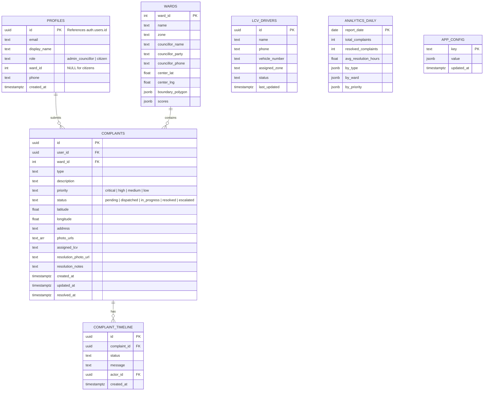

# 🗄️ Database Schema — CleanMadurai.AI

> Complete database documentation including schema, RLS policies, triggers, and migrations.

---

## Table of Contents

- [Overview](#overview)
- [Entity Relationship Diagram](#entity-relationship-diagram)
- [Table Definitions](#table-definitions)
- [Row Level Security Policies](#row-level-security-policies)
- [Triggers & Functions](#triggers--functions)
- [Migrations](#migrations)
- [Sample Data](#sample-data)

---

## Overview

CleanMadurai.AI uses **Supabase PostgreSQL** with 7 tables, 15+ RLS policies, and 2 database triggers. The schema supports real-time subscriptions via Supabase Realtime.

| Table | Purpose | PK Type |
|-------|---------|---------|
| `profiles` | User accounts & roles | UUID (FK → auth.users) |
| `complaints` | Citizen-reported issues | UUID |
| `complaint_timeline` | Status change audit trail | UUID |
| `wards` | 100 Madurai ward data | INT |
| `lcv_drivers` | Waste collection drivers | UUID |
| `analytics_daily` | Daily aggregated stats | DATE |
| `app_config` | Admin settings (key-value) | TEXT |

---

## Entity Relationship Diagram



---

## Table Definitions

### `profiles` — User Accounts

```sql
CREATE TABLE public.profiles (
  id           UUID PRIMARY KEY REFERENCES auth.users(id),
  email        TEXT,
  display_name TEXT,
  role         TEXT CHECK (role IN ('admin_councillor', 'citizen')),
  ward_id      INT REFERENCES public.wards(ward_id),
  phone        TEXT,
  created_at   TIMESTAMPTZ DEFAULT NOW()
);
```

**Role Assignment Logic:**
- First user to sign up → `admin_councillor`
- All subsequent users → `citizen`
- Managed by the `handle_new_user()` trigger function

---

### `complaints` — Citizen Reports

```sql
CREATE TABLE public.complaints (
  id                   UUID DEFAULT gen_random_uuid() PRIMARY KEY,
  user_id              UUID REFERENCES public.profiles(id) NOT NULL,
  ward_id              INT REFERENCES public.wards(ward_id),
  type                 TEXT NOT NULL CHECK (type IN (
    'overflowing_bin', 'bulk_waste', 'missed_collection',
    'dirty_toilet', 'dead_animal', 'other'
  )),
  description          TEXT,
  priority             TEXT DEFAULT 'medium' CHECK (priority IN ('critical','high','medium','low')),
  status               TEXT DEFAULT 'pending' CHECK (status IN (
    'pending', 'dispatched', 'in_progress', 'resolved', 'escalated'
  )),
  latitude             FLOAT,
  longitude            FLOAT,
  address              TEXT,
  photo_urls           TEXT[] DEFAULT '{}',
  assigned_lcv         TEXT,
  resolution_photo_url TEXT,
  resolution_notes     TEXT,
  created_at           TIMESTAMPTZ DEFAULT NOW(),
  updated_at           TIMESTAMPTZ DEFAULT NOW(),
  resolved_at          TIMESTAMPTZ
);

-- Enable Realtime for live updates
ALTER PUBLICATION supabase_realtime ADD TABLE public.complaints;
```

**Issue Types:**

| Type | Description |
|------|-------------|
| `overflowing_bin` | Overflowing waste bin |
| `bulk_waste` | Large/bulk waste dumping |
| `missed_collection` | Scheduled collection missed |
| `dirty_toilet` | Unsanitary public toilet |
| `dead_animal` | Dead animal carcass |
| `other` | Other sanitation issue |

**Status Lifecycle:**

```
pending → dispatched → in_progress → resolved
   ↓                       ↓
   escalated ←──────── escalated
```

---

### `complaint_timeline` — Audit Trail

```sql
CREATE TABLE public.complaint_timeline (
  id           UUID DEFAULT gen_random_uuid() PRIMARY KEY,
  complaint_id UUID REFERENCES public.complaints(id) ON DELETE CASCADE NOT NULL,
  status       TEXT NOT NULL,
  message      TEXT,
  actor_id     UUID REFERENCES public.profiles(id),
  created_at   TIMESTAMPTZ DEFAULT NOW()
);
```

---

### `wards` — Madurai Ward Data

```sql
CREATE TABLE public.wards (
  ward_id          INT PRIMARY KEY,
  name             TEXT NOT NULL,
  zone             TEXT CHECK (zone IN ('North','South','Central','West','East')),
  councillor_name  TEXT,
  councillor_party TEXT,
  councillor_phone TEXT,
  center_lat       FLOAT,
  center_lng       FLOAT,
  boundary_polygon JSONB,
  scores           JSONB DEFAULT '{}'
);
```

**100 wards** across 5 zones, each with GeoJSON boundary polygons for map rendering.

---

### `lcv_drivers` — Waste Collection Fleet

```sql
CREATE TABLE public.lcv_drivers (
  id             UUID DEFAULT gen_random_uuid() PRIMARY KEY,
  name           TEXT NOT NULL,
  phone          TEXT,
  vehicle_number TEXT,
  assigned_zone  TEXT,
  status         TEXT DEFAULT 'available' CHECK (status IN ('available','dispatched','off_duty')),
  last_updated   TIMESTAMPTZ DEFAULT NOW()
);
```

---

### `analytics_daily` — Aggregated Statistics

```sql
CREATE TABLE public.analytics_daily (
  report_date          DATE PRIMARY KEY DEFAULT CURRENT_DATE,
  total_complaints     INT DEFAULT 0,
  resolved_complaints  INT DEFAULT 0,
  avg_resolution_hours FLOAT DEFAULT 0,
  by_type              JSONB DEFAULT '{}',
  by_ward              JSONB DEFAULT '{}',
  by_priority          JSONB DEFAULT '{}'
);
```

Populated nightly by the `daily-analytics` Edge Function cron job.

---

### `app_config` — Application Settings

```sql
CREATE TABLE public.app_config (
  key        TEXT PRIMARY KEY,
  value      JSONB NOT NULL,
  updated_at TIMESTAMPTZ DEFAULT NOW()
);
```

---

## Row Level Security Policies

### Profiles

```sql
ALTER TABLE public.profiles ENABLE ROW LEVEL SECURITY;

-- Citizens can read their own profile
CREATE POLICY "Users read own profile" ON public.profiles
  FOR SELECT USING (auth.uid() = id);

-- Admin can read all profiles
CREATE POLICY "Admin reads all profiles" ON public.profiles
  FOR SELECT USING (
    (SELECT role FROM public.profiles WHERE id = auth.uid()) = 'admin_councillor'
  );

-- Users can update their own profile
CREATE POLICY "Users update own profile" ON public.profiles
  FOR UPDATE USING (auth.uid() = id);
```

### Complaints

```sql
ALTER TABLE public.complaints ENABLE ROW LEVEL SECURITY;

-- Any authenticated user can read complaints
CREATE POLICY "Anyone authed can read complaints" ON public.complaints
  FOR SELECT USING (auth.uid() IS NOT NULL);

-- Citizens can create complaints
CREATE POLICY "Citizens create complaints" ON public.complaints
  FOR INSERT WITH CHECK (auth.uid() IS NOT NULL);

-- Admin can update any complaint
CREATE POLICY "Admin updates complaints" ON public.complaints
  FOR UPDATE USING (
    (SELECT role FROM public.profiles WHERE id = auth.uid()) = 'admin_councillor'
  );

-- Citizens can update their own complaints
CREATE POLICY "Citizens update own complaints" ON public.complaints
  FOR UPDATE USING (auth.uid() = user_id);

-- Admin can delete complaints
CREATE POLICY "Admin deletes complaints" ON public.complaints
  FOR DELETE USING (
    (SELECT role FROM public.profiles WHERE id = auth.uid()) = 'admin_councillor'
  );
```

### Other Tables

```sql
-- Wards: public read, admin write
ALTER TABLE public.wards ENABLE ROW LEVEL SECURITY;
CREATE POLICY "Public read wards" ON public.wards FOR SELECT USING (true);
CREATE POLICY "Admin manages wards" ON public.wards FOR ALL USING (
  (SELECT role FROM public.profiles WHERE id = auth.uid()) = 'admin_councillor'
);

-- LCV Drivers: admin only
ALTER TABLE public.lcv_drivers ENABLE ROW LEVEL SECURITY;
CREATE POLICY "Admin manages drivers" ON public.lcv_drivers FOR ALL USING (
  (SELECT role FROM public.profiles WHERE id = auth.uid()) = 'admin_councillor'
);

-- Analytics: admin read only
ALTER TABLE public.analytics_daily ENABLE ROW LEVEL SECURITY;
CREATE POLICY "Admin reads analytics" ON public.analytics_daily FOR SELECT USING (
  (SELECT role FROM public.profiles WHERE id = auth.uid()) = 'admin_councillor'
);
```

---

## Triggers & Functions

### Auto-Role Assignment

```sql
CREATE OR REPLACE FUNCTION public.handle_new_user()
RETURNS TRIGGER AS $$
DECLARE
  user_count INT;
  assigned_role TEXT;
BEGIN
  SELECT COUNT(*) INTO user_count FROM public.profiles;

  IF user_count = 0 THEN
    assigned_role := 'admin_councillor';  -- First user
  ELSE
    assigned_role := 'citizen';            -- Everyone else
  END IF;

  INSERT INTO public.profiles (id, email, display_name, role, created_at)
  VALUES (
    NEW.id,
    NEW.email,
    COALESCE(NEW.raw_user_meta_data->>'full_name', split_part(NEW.email, '@', 1)),
    assigned_role,
    NOW()
  );

  RETURN NEW;
END;
$$ LANGUAGE plpgsql SECURITY DEFINER;

-- Attach trigger to auth.users
CREATE TRIGGER on_auth_user_created
  AFTER INSERT ON auth.users
  FOR EACH ROW EXECUTE FUNCTION public.handle_new_user();
```

---

## Migrations

| File | Description |
|------|-------------|
| `20260228000000_initial_schema.sql` | Full schema creation + RLS + triggers |
| `add_notifications.sql` | Notification system for admin alerts |
| `seed_sample_data.sql` | Development seed data |
| `seed_wards.sql` | 100 Madurai ward data + councillors |

Run migrations via Supabase CLI:
```bash
supabase db push
```

---

## Sample Data

The `seed_sample_data.sql` file includes mock data for testing:
- 5 sample complaints with various statuses and priorities
- 3 LCV drivers
- Timeline entries for status tracking
- Analytics data for dashboard testing

---

<p align="center">
  <em>See <a href="architecture.md">architecture.md</a> for system design | <a href="api-reference.md">api-reference.md</a> for Edge Function docs</em>
</p>
